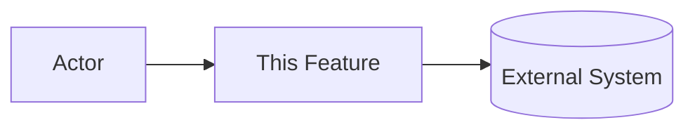
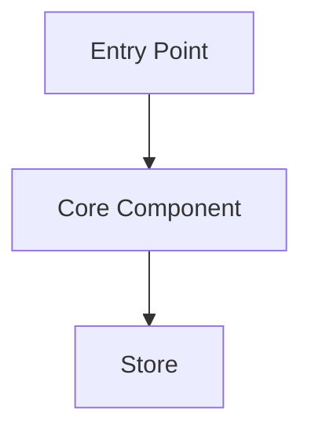
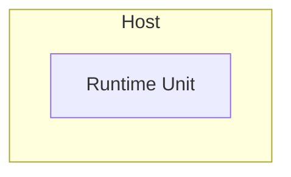
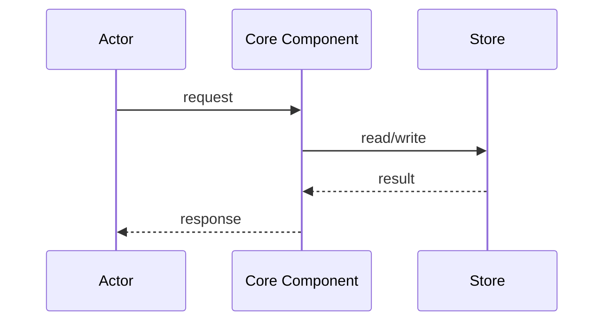

# Architecture: [FEATURE]

**Branch**: `[###-feature-name]` | **Date**: [DATE] | **Plan**: [plan.md](./plan.md)

**Input**: Implementation plan from `/specs/[###-feature-name]/plan.md`

**Note**: This template is filled in by the `__SPECKIT_COMMAND_PLAN__` command during
Phase 2; its definition describes the execution workflow.

<!--
  ============================================================================
  EVERY SECTION BELOW IS REQUIRED.

  If a section does not apply to this feature, keep the heading and write:

      N/A - <one-line reason>

  Do NOT delete the section, and do NOT invent a one-box diagram to fill it.
  A single-file utility with nothing to deploy says so; that is useful
  information, an empty box is not.

  Diagrams use Mermaid, which renders in the tools this project already
  documents itself with. Do not introduce another diagram format.
  ============================================================================
-->

## Architectural Overview

<!-- ACTION REQUIRED: 3-5 sentences. What are the moving parts and why these? -->

[Describe the shape of the system for this feature: the major components, the boundary
between them, and the one architectural idea a reader most needs to hold.]

## System Context

<!--
  ACTION REQUIRED: External actors and systems only. What sits OUTSIDE the
  boundary and talks to this feature. Internals belong in Component Architecture.
-->

## Component Architecture

<!-- ACTION REQUIRED: The components INSIDE the boundary and how they connect. -->

| Component | Responsibility | Entities owned |
|-----------|----------------|----------------|
| [name] | [single clear purpose] | [entities from data-model.md, or none] |

## Deployment Topology

<!--
  ACTION REQUIRED: Runtime units, where they run, and the network boundaries
  between them. For a local CLI or a library this is often genuinely N/A.
-->

## Data Flow

<!-- ACTION REQUIRED: Order of movement through the components, for key flows. -->

## Cross-Cutting Concerns

<!-- ACTION REQUIRED: How this feature handles each. N/A with a reason is valid. -->

| Concern | Approach |
|---------|----------|
| Authentication / authorization | [approach, or N/A - reason] |
| Error handling | [approach] |
| Observability | [logs, metrics, traces, or N/A - reason] |
| Configuration | [where settings come from] |

## Architectural Decisions

<!--
  ACTION REQUIRED: Reference decisions recorded in research.md by heading.
  Do NOT restate their rationale or alternatives here - research.md owns those,
  and duplicating them creates two sources of truth that drift.
-->

| Decision | Recorded in |
|----------|-------------|
| [short statement of what was decided] | [research.md heading] |

## Phase 1 Reconciliation

<!--
  ACTION REQUIRED: This architecture was authored AFTER data-model.md and
  contracts/ in the same planning run. Check it against them and record every
  conflict found, rather than silently absorbing the earlier shape.

  Write "No conflicts found." if the architecture and the Phase 1 artifacts
  agree. Never leave this section blank.
-->

| Conflict with data-model.md or contracts/ | Action taken |
|-------------------------------------------|--------------|
| [what disagrees, and where] | [artifact revised / architecture adjusted / deferred with reason] |
