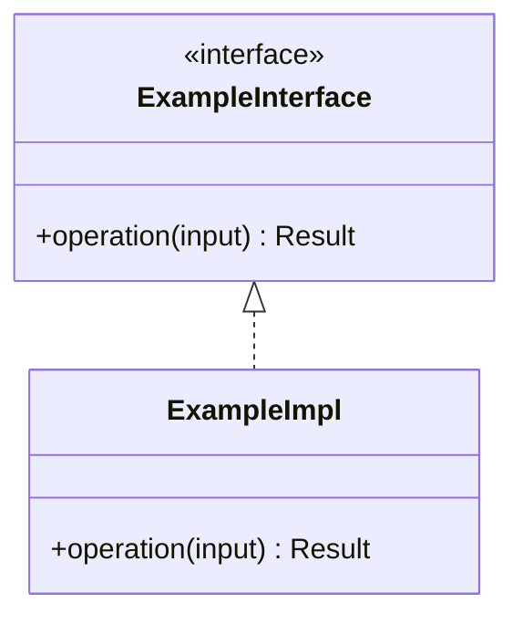
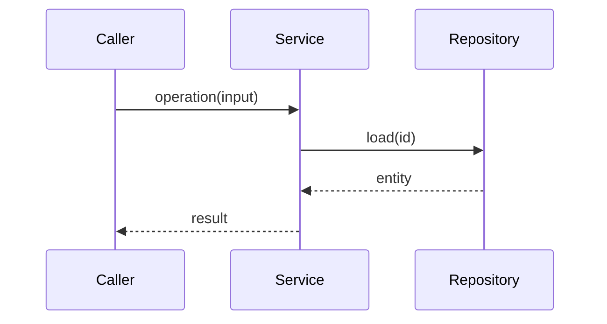
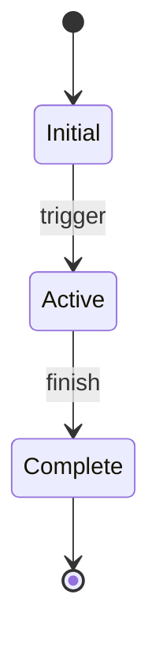

# Design: [FEATURE]

**Branch**: `[###-feature-name]` | **Date**: [DATE] | **Plan**: [plan.md](./plan.md)

**Input**: Implementation plan from `/specs/[###-feature-name]/plan.md` and system shape
from `/specs/[###-feature-name]/architecture.md`

**Note**: This template is filled in by the `__SPECKIT_COMMAND_PLAN__` command during
Phase 2; its definition describes the execution workflow.

<!--
  ============================================================================
  EVERY SECTION BELOW IS REQUIRED.

  If a section does not apply to this feature, keep the heading and write:

      N/A - <one-line reason>

  Do NOT delete the section, and do NOT invent structure to fill it.

  TWO HARD CONSTRAINTS:

  1. Signatures only. This document describes shape, not behaviour. No
     implementation bodies, no model/service/controller internals - those
     belong to tasks.md and the implementation phase.

  2. Link, never copy. Entity fields and validation rules live in
     data-model.md. Restating them here creates two sources of truth that
     drift on the first edit.

  Language and version come from the Technical Context in plan.md, which
  remains the sole source of truth for the technology stack.
  ============================================================================
-->

## Module & File Layout

<!--
  ACTION REQUIRED: Concrete paths. These MUST match the Structure Decision in
  plan.md - if they disagree, one of the two documents is wrong.
-->

```text
src/
├── [module]/
│   ├── [file]              # [responsibility]
│   └── [file]              # [responsibility]
└── [module]/
```

## Class & Interface Model

<!--
  ACTION REQUIRED: The types this feature introduces and how they relate.
  Show interfaces and their implementations, not every field.
-->



| Type | Kind | Responsibility |
|------|------|----------------|
| [name] | interface / class / record | [single clear purpose] |

## Interface Contracts

<!--
  ACTION REQUIRED: Signatures only, in the language from plan.md Technical
  Context. No implementation bodies. If the project exposes formal contracts,
  reference contracts/ rather than restating them.
-->

```text
[language]

[return_type] operation([param_type] param)
    precondition:  [what must hold on entry]
    postcondition: [what holds on return]
    raises:        [error type, or none]
```

## Sequence Diagrams

<!-- ACTION REQUIRED: One diagram per key flow. Order of calls, not internals. -->



## State Model

<!--
  ACTION REQUIRED: Lifecycle states and transitions. Many features have no
  meaningful lifecycle - say so rather than drawing a two-box diagram.
-->



## Error Handling & Validation

<!-- ACTION REQUIRED: What can go wrong, what happens, and where the user sees it. -->

| Condition | Behavior | Surfaced where |
|-----------|----------|----------------|
| [invalid input] | [reject with which error] | [caller / log / exit code] |
| [dependency unavailable] | [retry / degrade / fail] | [where] |

## Persistence Mapping

<!--
  ACTION REQUIRED: Which class owns which entity. Link to data-model.md for
  the field-level definitions; do NOT copy fields or validation rules here.
  If the feature stores nothing, write N/A with a reason.
-->

| Entity (see [data-model.md](./data-model.md)) | Owning type | Notes |
|-----------------------------------------------|-------------|-------|
| [entity name] | [class or repository] | [relationship, cardinality] |
